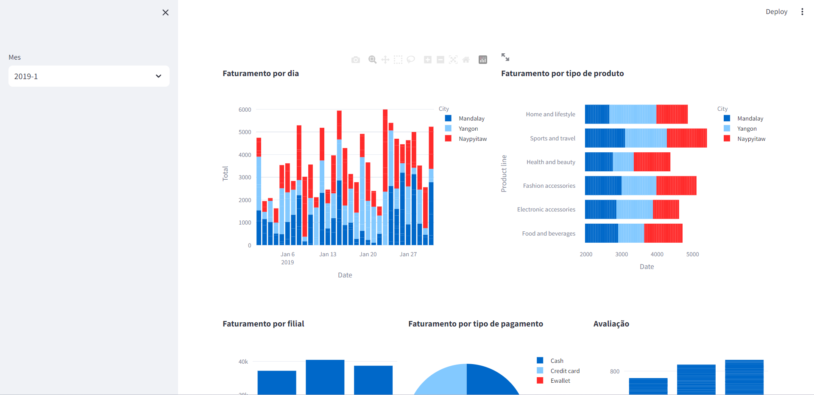
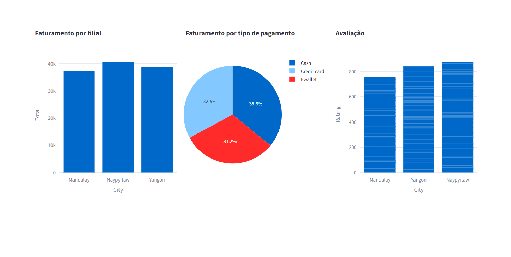

# Análise de Vendas de Supermercado

Este é um aplicativo Streamlit para visualizar e analisar os dados de vendas de um supermercado. Ele usa pandas para carregar e manipular os dados, Plotly Express para criar visualizações interativas e Streamlit para criar a interface do usuário.

## Configuração
Certifique-se de que você tem todas as bibliotecas necessárias instaladas. Você pode instalá-las usando pip:
pip install streamlit pandas plotly

### Executando o Aplicativo
Para executar o aplicativo, use o seguinte comando:

Isso iniciará o aplicativo e abrirá uma janela no seu navegador.

## Funcionalidades
O aplicativo carrega os dados de vendas de um arquivo CSV.
Ele permite que você selecione um mês específico para análise.
Exibe visualizações interativas com informações sobre o faturamento diário, tipos de produtos, filiais, tipos de pagamento e avaliações.

#### Estrutura do Código
O código Python principal está no arquivo supermarket_sales_app.py. Ele utiliza as bibliotecas mencionadas anteriormente para carregar os dados, criar visualizações e construir a interface do usuário.

O aplicativo é organizado da seguinte forma:

Configuração da página do Streamlit.
Leitura e pré-processamento dos dados.
Seleção de mês através de um seletor na barra lateral.
Criação de visualizações interativas usando Plotly Express.
Exibição das visualizações em colunas para melhor organização.
Sinta-se à vontade para explorar e modificar o código para atender às suas necessidades.

#### Fonte dos Dados
Os dados usados neste aplicativo são provenientes de um arquivo CSV chamado supermarket_sales.csv. Certifique-se de que o arquivo esteja presente no mesmo diretório que o arquivo do aplicativo.

